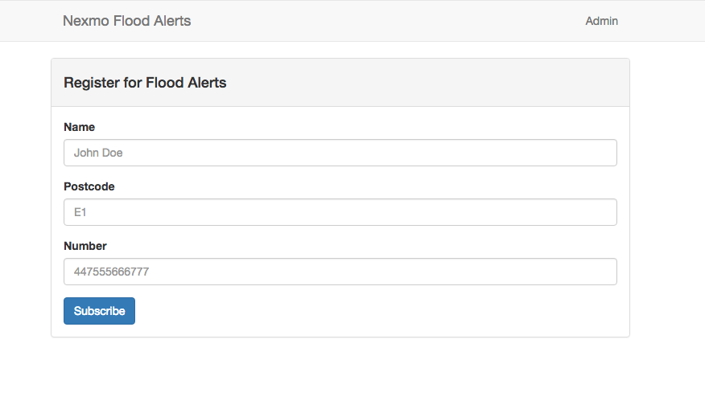

# Nexmo Sinatra Voice Alerts Broadcast System

A demo that implements broadcast alerts in Ruby
using Sinatra and the [Nexmo Text-To-Speech API](https://docs.nexmo.com/voice/text-to-speech).

## Subscriptions

The [subscriptions](../../tree/subscriptions) branch is the starting point of the tutorial and is just a simple Sinatra app that allows a person to
subscribe to alerts with their name, postcode, and phone number.

### Usage

* Clone this repository
* Run `git checkout subscriptions`
* Run `bundle install`
* Run `bundle exec rake db:migrate`
* Run `ruby app.rb`
* Visit [http://localhost:4567](http://localhost:4567)
* Subscribe a number

## Broadcast Alerts

The [alerts](../../tree/alerts) branch is the end point of out tutorial,
adding way to target subscribers with a Flood Alert.

The differences between these two branches can be seen [here](../../compare/subscriptions...alerts)
and in our in-dept tutorial.

### Usage

* Clone this repository
* Run `git checkout alerts`
* Run `bundle install`
* Run `bundle exec rake db:migrate`
* Copy `.env.example` to `.env` and add your [Nexmo API key and secret](https://dashboard.nexmo.com/settings), and a Nexmo voice enabled phone
number
* Run `ruby app.rb`
* Visit [http://localhost:4567](http://localhost:4567)
* Subscribe a number
* Head to `/admin` and send a alert to your number

## License

This sample is released under the [MIT License][license]

[license]: LICENSE.txt
